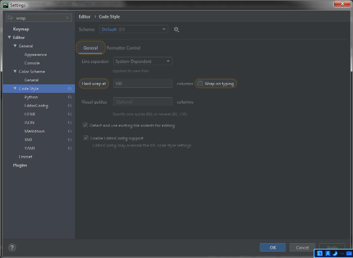
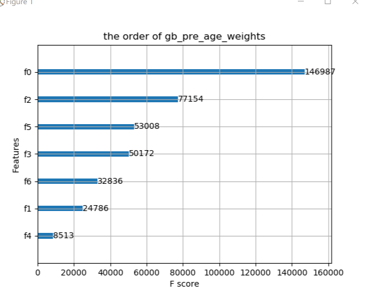
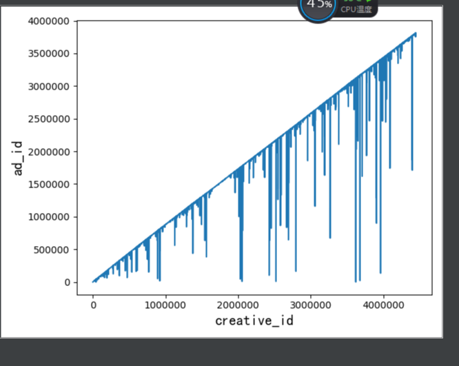

# 2020-05-28

1. 这是一个任务文件，每个任务结束后，需要输入 姓名+OK

   -   zYx.Tom.OK
2. 请把编辑代码的宽度设置为 Hard wrap at 100

   -   zYx.Tom.OK
   -   
3. 请在代码的 csv 文件头上给出字段名称，具体可以参考 MLP.py
   -   zYx.Tom.OK
       -   MLP.py
       -   xgboost实现年龄的预测.py
       -   年龄预测无正则化.py
       -   性别预测有正泽.py
       -   调用xgboost实现性别分类.py
4. XGBoost 训练后的权重列表
    -  「CSV」文件字段名称
       -  "creative_id","click_times","ad_id","product_id","product_category","advertiser_id","industry",
       -  "age" 和 "gender" 的权重结果是一样的
       -  
       -  